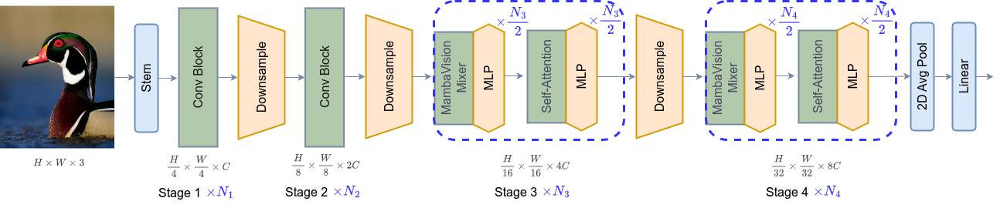

# MambaVision: A Hybrid Mamba-Transformer Vision Backbone

Official PyTorch implementation of [**MambaVision: A Hybrid Mamba-Transformer Vision Backbone**](https://arxiv.org/abs/2407.08083).


[](https://github.com/NVlabs/MambaVision/stargazers)

[Ali Hatamizadeh](https://research.nvidia.com/person/ali-hatamizadeh) and
[Jan Kautz](https://jankautz.com/). 

For business inquiries, please visit our website and submit the form: [NVIDIA Research Licensing](https://www.nvidia.com/en-us/research/inquiries/)

Try MambaVision: [](https://colab.research.google.com/drive/1WR8LAzRMoK19RiFA-Br0Xxir_Htb3pLf)

--- 

MambaVision demonstrates a strong performance by achieving a new SOTA Pareto-front in
terms of Top-1 accuracy and throughput. 

<p align="center">

</p>


We introduce a novel mixer block by creating a symmetric path without SSM to enhance the modeling of global context: 


<p align="center">

</p>


MambaVision has a hierarchical architecture that employs both self-attention and mixer blocks:




## 💥 News 💥
- **[06.10.2025]** The MambaVision [poster](https://github.com/NVlabs/MambaVision/blob/main/mambavision/assets/mamba_vision_poster_cvpr25.pdf) will be presented in CVPR 2025 in Nashville on Sunday, June 15, 2025, from 10:30 a.m. to 12:30 p.m. CDT in Exhibit Hall D, Poster #403.
  
- **[06.10.2025]** Semantic segmentation code and models released [here](https://github.com/NVlabs/MambaVision/tree/main/semantic_segmentation) !

- **[06.07.2025]** Object detection code and models released [here](https://github.com/NVlabs/MambaVision/tree/main/object_detection) !

- **[03.29.2025]** You can now easily run MambaVision in Google Colab. Try here: [](https://colab.research.google.com/drive/1WR8LAzRMoK19RiFA-Br0Xxir_Htb3pLf)

- **[03.29.2025]** New MambaVision [pip package](https://pypi.org/project/mambavision/) released ! 

- **[03.25.2025]** Updated [manuscript](https://arxiv.org/pdf/2407.08083) is now available on arXiv !
- **[03.25.2025]** 21K models and code added to the repository.

- **[03.25.2025]** MambaVision is the **first** mamba-based vision backbone at scale ! 

- **[03.24.2025]** [MambaVision-L3-512-21K](https://huggingface.co/nvidia/MambaVision-L3-512-21K) achieves a **Top-1 accuracy of 88.1** % 

- **[03.24.2025]** New ImageNet-21K models have been added to [MambaVision Hugging Face collection](https://huggingface.co/collections/nvidia/mambavision-66943871a6b36c9e78b327d3) 

- **[02.26.2025]** MambaVision has been accepted to CVPR 2025 ! 

- **[07.24.2024]** MambaVision [Hugging Face](https://huggingface.co/collections/nvidia/mambavision-66943871a6b36c9e78b327d3) models are released ! 

- **[07.14.2024]** We added support for processing any resolution images.

- **[07.12.2024]** [Paper](https://arxiv.org/abs/2407.08083) is now available on arXiv !

- **[07.11.2024]** [Mambavision pip package](https://pypi.org/project/mambavision/) is released !

- **[07.10.2024]** We have released the code and model checkpoints for Mambavision !

## Quick Start

### Google Colab

You can simply try image classification with MambaVision in Google Colab: [](https://colab.research.google.com/drive/1WR8LAzRMoK19RiFA-Br0Xxir_Htb3pLf)


### Hugging Face (Classification + Feature extraction)

Pretrained MambaVision models can be simply used via [Hugging Face](https://huggingface.co/collections/nvidia/mambavision-66943871a6b36c9e78b327d3) library with **a few lines of code**. First install the requirements: 

```bash
pip install mambavision
```

The model can be simply imported:


```python
>>> from transformers import AutoModelForImageClassification

>>> model = AutoModelForImageClassification.from_pretrained("nvidia/MambaVision-T-1K", trust_remote_code=True)
```

We demonstrate an end-to-end image classification example in the following.

Given the following image from [COCO dataset](https://cocodataset.org/#home)  val set as an input:


<p align="center">

</p>


The following snippet can be used:

```python
from transformers import AutoModelForImageClassification
from PIL import Image
from timm.data.transforms_factory import create_transform
import requests

model = AutoModelForImageClassification.from_pretrained("nvidia/MambaVision-T-1K", trust_remote_code=True)

# eval mode for inference
model.cuda().eval()

# prepare image for the model
url = 'http://images.cocodataset.org/val2017/000000020247.jpg'
image = Image.open(requests.get(url, stream=True).raw)
input_resolution = (3, 224, 224)  # MambaVision supports any input resolutions

transform = create_transform(input_size=input_resolution,
                             is_training=False,
                             mean=model.config.mean,
                             std=model.config.std,
                             crop_mode=model.config.crop_mode,
                             crop_pct=model.config.crop_pct)

inputs = transform(image).unsqueeze(0).cuda()
# model inference
outputs = model(inputs)
logits = outputs['logits'] 
predicted_class_idx = logits.argmax(-1).item()
print("Predicted class:", model.config.id2label[predicted_class_idx])
```

The predicted label is brown bear, bruin, Ursus arctos.


You can also use Hugging Face MambaVision models for feature extraction. The model provides the outputs of each stage of model (hierarchical multi-scale features in 4 stages) as well as the final averaged-pool features that are flattened. The former is used for downstream tasks such as classification and detection. 

The following snippet can be used for feature extraction:

```Python
from transformers import AutoModel
from PIL import Image
from timm.data.transforms_factory import create_transform
import requests

model = AutoModel.from_pretrained("nvidia/MambaVision-T-1K", trust_remote_code=True)

# eval mode for inference
model.cuda().eval()

# prepare image for the model
url = 'http://images.cocodataset.org/val2017/000000020247.jpg'
image = Image.open(requests.get(url, stream=True).raw)
input_resolution = (3, 224, 224)  # MambaVision supports any input resolutions

transform = create_transform(input_size=input_resolution,
                             is_training=False,
                             mean=model.config.mean,
                             std=model.config.std,
                             crop_mode=model.config.crop_mode,
                             crop_pct=model.config.crop_pct)
inputs = transform(image).unsqueeze(0).cuda()
# model inference
out_avg_pool, features = model(inputs)
print("Size of the averaged pool features:", out_avg_pool.size())  # torch.Size([1, 640])
print("Number of stages in extracted features:", len(features)) # 4 stages
print("Size of extracted features in stage 1:", features[0].size()) # torch.Size([1, 80, 56, 56])
print("Size of extracted features in stage 4:", features[3].size()) # torch.Size([1, 640, 7, 7])
```

Currently, we offer [MambaVision-T-1K](https://huggingface.co/nvidia/MambaVision-T-1K), [MambaVision-T2-1K](https://huggingface.co/nvidia/MambaVision-T2-1K), [MambaVision-S-1K](https://huggingface.co/nvidia/MambaVision-S-1K), [MambaVision-B-1K](https://huggingface.co/nvidia/MambaVision-B-1K), [MambaVision-L-1K](https://huggingface.co/nvidia/MambaVision-L-1K) and [MambaVision-L2-1K](https://huggingface.co/nvidia/MambaVision-L2-1K) on Hugging Face. All models can also be viewed [here](https://huggingface.co/collections/nvidia/mambavision-66943871a6b36c9e78b327d3).

### Classification (pip package)

We can also import pre-trained MambaVision models from the pip package with **a few lines of code**:

```bash
pip install mambavision
```

A pretrained MambaVision model with default hyper-parameters can be created as in:

```python
>>> from mambavision import create_model

# Define mamba_vision_T model

>>> model = create_model('mamba_vision_T', pretrained=True, model_path="/tmp/mambavision_tiny_1k.pth.tar")
```

Available list of pretrained models include `mamba_vision_T`, `mamba_vision_T2`, `mamba_vision_S`, `mamba_vision_B`, `mamba_vision_L` and `mamba_vision_L2`.  

We can also simply test the model by passing a dummy image with **any resolution**. The output is the logits:

```python
>>> import torch

>>> image = torch.rand(1, 3, 512, 224).cuda() # place image on cuda
>>> model = model.cuda() # place model on cuda
>>> output = model(image) # output logit size is [1, 1000]
```

Using the pretrained models from our pip package, you can simply run validation:

```
python validate_pip_model.py --model mamba_vision_T --data_dir=$DATA_PATH --batch-size $BS 
``` 

## Results + Pretrained Models

### ImageNet-21K

<table>
  <tr>
    <th>Name</th>
    <th>Acc@1(%)</th>
    <th>Acc@5(%)</th>
    <th>#Params(M)</th>
    <th>FLOPs(G)</th>
    <th>Resolution</th>
    <th>HF</th>
    <th>Download</th>
  </tr>

<tr>
    <td>MambaVision-B-21K</td>
    <td>84.9</td>
    <td>97.5</td>
    <td>97.7</td>
    <td>15.0</td>
    <td>224x224</td>
    <td><a href="https://huggingface.co/nvidia/MambaVision-B-21K">link</a></td>
    <td><a href="https://huggingface.co/nvidia/MambaVision-B-21K/resolve/main/mambavision_base_21k.pth.tar">model</a></td>
</tr>

<tr>
    <td>MambaVision-L-21K</td>
    <td>86.1</td>
    <td>97.9</td>
    <td>227.9</td>
    <td>34.9</td>
    <td>224x224</td>
    <td><a href="https://huggingface.co/nvidia/MambaVision-L-21K">link</a></td>
    <td><a href="https://huggingface.co/nvidia/MambaVision-L-21K/resolve/main/mambavision_large_21k.pth.tar">model</a></td>
</tr>

<tr>
    <td>MambaVision-L2-512-21K</td>
    <td>87.3</td>
    <td>98.4</td>
    <td>241.5</td>
    <td>196.3</td>
    <td>512x512</td>
    <td><a href="https://huggingface.co/nvidia/MambaVision-L2-512-21K">link</a></td>
    <td><a href="https://huggingface.co/nvidia/MambaVision-L2-512-21K/resolve/main/mambavision_L2_21k_240m_512.pth.tar">model</a></td>
</tr>

<tr>
    <td>MambaVision-L3-256-21K</td>
    <td>87.3</td>
    <td>98.3</td>
    <td>739.6</td>
    <td>122.3</td>
    <td>256x256</td>
    <td><a href="https://huggingface.co/nvidia/MambaVision-L3-256-21K">link</a></td>
    <td><a href="https://huggingface.co/nvidia/MambaVision-L3-256-21K/resolve/main/mambavision_L3_21k_740m_256.pth.tar">model</a></td>
</tr>

<tr>
    <td>MambaVision-L3-512-21K</td>
    <td>88.1</td>
    <td>98.6</td>
    <td>739.6</td>
    <td>489.1</td>
    <td>512x512</td>
    <td><a href="https://huggingface.co/nvidia/MambaVision-L3-512-21K">link</a></td>
    <td><a href="https://huggingface.co/nvidia/MambaVision-L3-512-21K/resolve/main/mambavision_L3_21k_740m_512.pth.tar">model</a></td>
</tr>

</table>


### ImageNet-1K

<table>
  <tr>
    <th>Name</th>
    <th>Acc@1(%)</th>
    <th>Acc@5(%)</th>
    <th>Throughput(Img/Sec)</th>
    <th>Resolution</th>
    <th>#Params(M)</th>
    <th>FLOPs(G)</th>
    <th>HF</th>
    <th>Download</th>
  </tr>

<tr>
    <td>MambaVision-T</td>
    <td>82.3</td>
    <td>96.2</td>
    <td>6298</td>
    <td>224x224</td>
    <td>31.8</td>
    <td>4.4</td>
    <td><a href="https://huggingface.co/nvidia/MambaVision-T-1K">link</a></td>
    <td><a href="https://huggingface.co/nvidia/MambaVision-T-1K/resolve/main/mambavision_tiny_1k.pth.tar">model</a></td>
</tr>

<tr>
    <td>MambaVision-T2</td>
    <td>82.7</td>
    <td>96.3</td>
    <td>5990</td>
    <td>224x224</td>
    <td>35.1</td>
    <td>5.1</td>
    <td><a href="https://huggingface.co/nvidia/MambaVision-T2-1K">link</a></td>
    <td><a href="https://huggingface.co/nvidia/MambaVision-T2-1K/resolve/main/mambavision_tiny2_1k.pth.tar">model</a></td>
</tr>

<tr>
    <td>MambaVision-S</td>
    <td>83.3</td>
    <td>96.5</td>
    <td>4700</td>
    <td>224x224</td>
    <td>50.1</td>
    <td>7.5</td>
    <td><a href="https://huggingface.co/nvidia/MambaVision-S-1K">link</a></td>
    <td><a href="https://huggingface.co/nvidia/MambaVision-S-1K/resolve/main/mambavision_small_1k.pth.tar">model</a></td>
</tr>

<tr>
    <td>MambaVision-B</td>
    <td>84.2</td>
    <td>96.9</td>
    <td>3670</td>
    <td>224x224</td>
    <td>97.7</td>
    <td>15.0</td>
    <td><a href="https://huggingface.co/nvidia/MambaVision-B-1K">link</a></td>
    <td><a href="https://huggingface.co/nvidia/MambaVision-B-1K/resolve/main/mambavision_base_1k.pth.tar">model</a></td>
</tr>

<tr>
    <td>MambaVision-L</td>
    <td>85.0</td>
    <td>97.1</td>
    <td>2190</td>
    <td>224x224</td>
    <td>227.9</td>
    <td>34.9</td>
    <td><a href="https://huggingface.co/nvidia/MambaVision-L-1K">link</a></td>
    <td><a href="https://huggingface.co/nvidia/MambaVision-L-1K/resolve/main/mambavision_large_1k.pth.tar">model</a></td>
</tr>

<tr>
    <td>MambaVision-L2</td>
    <td>85.3</td>
    <td>97.2</td>
    <td>1021</td>
    <td>224x224</td>
    <td>241.5</td>
    <td>37.5</td>
    <td><a href="https://huggingface.co/nvidia/MambaVision-L2-1K">link</a></td>
    <td><a href="https://huggingface.co/nvidia/MambaVision-L2-1K/resolve/main/mambavision_large2_1k.pth.tar">model</a></td>
</tr>

</table>

## Detection Results + Models 

<table>
  <tr>
    <th>Backbone</th>
    <th>Detector</th>
    <th>Lr Schd</th>
    <th>box mAP</th>
    <th>mask mAP</th>
    <th>#Params(M)</th>
    <th>FLOPs(G)</th>
    <th>Config</th>
    <th>Log</th>
    <th>Model Ckpt</th>
  </tr>

<tr>
    <td><a href="https://huggingface.co/nvidia/MambaVision-T-1K">MambaVision-T-1K</a></td>
    <td>Cascade Mask R-CNN</td>
    <td>3x</td>
    <td>51.1</td>
    <td>44.3</td>
    <td>86</td>
    <td>740</td>
    <td><a href="https://github.com/NVlabs/MambaVision/blob/main/object_detection/configs/mamba_vision/cascade_mask_rcnn_mamba_vision_tiny_3x_coco.py">config</a></td>
    <td><a href="https://github.com/NVlabs/MambaVision/blob/main/object_detection/tools/work_dirs/cascade_mask_rcnn_mamba_vision_tiny_3x_coco/20250607_142007/20250607_142007.log">log</a></td>
    <td><a href="https://huggingface.co/nvidia/cascade_mask_rcnn_mamba_vision_tiny_3x_coco/resolve/main/cascade_mask_rcnn_mamba_vision_tiny_3x_coco.pth">model</a></td>
</tr>

<tr>
    <td><a href="https://huggingface.co/nvidia/MambaVision-S-1K">MambaVision-S-1K</a></td>
    <td>Cascade Mask R-CNN</td>
    <td>3x</td>
    <td>52.3</td>
    <td>45.2</td>
    <td>108</td>
    <td>828</td>
    <td><a href="https://github.com/NVlabs/MambaVision/blob/main/object_detection/configs/mamba_vision/cascade_mask_rcnn_mamba_vision_small_3x_coco.py">config</a></td>
    <td><a href="https://github.com/NVlabs/MambaVision/blob/main/object_detection/tools/work_dirs/cascade_mask_rcnn_mamba_vision_small_3x_coco/20250607_144612/20250607_144612.log">log</a></td>
    <td><a href="https://huggingface.co/nvidia/cascade_mask_rcnn_mamba_vision_tiny_3x_coco/resolve/main/cascade_mask_rcnn_mamba_vision_tiny_3x_coco.pth">model</a></td>
</tr>

<tr>
    <td><a href="https://huggingface.co/nvidia/MambaVision-B-1K">MambaVision-B-1K</a></td>
    <td>Cascade Mask R-CNN</td>
    <td>3x</td>
    <td>52.8</td>
    <td>45.7</td>
    <td>145</td>
    <td>964</td>
    <td><a href="https://github.com/NVlabs/MambaVision/blob/main/object_detection/configs/mamba_vision/cascade_mask_rcnn_mamba_vision_base_3x_coco.py">config</a></td>
    <td><a href="https://github.com/NVlabs/MambaVision/blob/main/object_detection/tools/work_dirs/cascade_mask_rcnn_mamba_vision_base_3x_coco/20250607_145939/20250607_145939.log">log</a></td>
    <td><a href="https://huggingface.co/nvidia/cascade_mask_rcnn_mamba_vision_base_3x_coco/resolve/main/cascade_mask_rcnn_mamba_vision_base_3x_coco.pth">model</a></td>
</tr>

</table>

##  Segmentation Results + Models 

<table>
  <tr>
    <th>Backbone</th>
    <th>Method</th>
    <th>Lr Schd</th>
    <th>mIoU</th>
    <th>#Params(M)</th>
    <th>FLOPs(G)</th>
    <th>Config</th>
    <th>Log</th>
    <th>Model Ckpt</th>
  </tr>

<tr>
    <td><a href="https://huggingface.co/nvidia/MambaVision-T-1K">MambaVision-T-1K</a></td>
    <td>UPerNet</td>
    <td>160K</td>
    <td>46.0</td>
    <td>55</td>
    <td>945</td>
    <td><a href="https://github.com/NVlabs/MambaVision/blob/main/semantic_segmentation/configs/mamba_vision/mamba_vision_160k_ade20k-512x512_tiny.py">config</a></td>
    <td><a href="https://github.com/NVlabs/MambaVision/blob/main/semantic_segmentation/tools/logs/mamba_vision_160k_ade20k-512x512_tiny.log">log</a></td>
    <td><a href="https://huggingface.co/nvidia/mamba_vision_160k_ade20k-512x512_tiny/resolve/main/mamba_vision_160k_ade20k-512x512_tiny.pth">model</a></td>
</tr>


<tr>
    <td><a href="https://huggingface.co/nvidia/MambaVision-S-1K">MambaVision-S-1K</a></td>
    <td>UPerNet</td>
    <td>160K</td>
    <td>48.2</td>
    <td>84</td>
    <td>1135</td>
    <td><a href="https://github.com/NVlabs/MambaVision/blob/main/semantic_segmentation/configs/mamba_vision/mamba_vision_160k_ade20k-512x512_small.py">config</a></td>
    <td><a href="https://github.com/NVlabs/MambaVision/blob/main/semantic_segmentation/tools/logs/mamba_vision_160k_ade20k-512x512_small.log">log</a></td>
    <td><a href="https://huggingface.co/nvidia/mamba_vision_160k_ade20k-512x512_small/resolve/main/mamba_vision_160k_ade20k-512x512_small.pth">model</a></td>
</tr>

<tr>
    <td><a href="https://huggingface.co/nvidia/MambaVision-B-1K">MambaVision-B-1K</a></td>
    <td>UPerNet</td>
    <td>160K</td>
    <td>49.1</td>
    <td>126</td>
    <td>1342</td>
    <td><a href="https://github.com/NVlabs/MambaVision/blob/main/semantic_segmentation/configs/mamba_vision/mamba_vision_160k_ade20k-512x512_base.py">config</a></td>
    <td><a href="https://github.com/NVlabs/MambaVision/blob/main/semantic_segmentation/tools/logs/mamba_vision_160k_ade20k-512x512_base.log">log</a></td>
    <td><a href="https://huggingface.co/nvidia/mamba_vision_160k_ade20k-512x512_base/resolve/main/mamba_vision_160k_ade20k-512x512_base.pth">model</a></td>
</tr>


<tr>
    <td><a href="https://huggingface.co/nvidia/MambaVision-L3-512-21K">MambaVision-L3-512-21K</a></td>
    <td>UPerNet</td>
    <td>160K</td>
    <td>53.2</td>
    <td>780</td>
    <td>3670</td>
    <td><a href="https://github.com/NVlabs/MambaVision/blob/main/semantic_segmentation/configs/mamba_vision/mamba_vision_160k_ade20k-640x640_l3_21k.py">config</a></td>
    <td><a href="https://github.com/NVlabs/MambaVision/blob/main/semantic_segmentation/tools/logs/mamba_vision_160k_ade20k-640x640_l3_21k.log">log</a></td>
    <td><a href="https://huggingface.co/nvidia/mamba_vision_160k_ade20k-640x640_l3_21k/resolve/main/mamba_vision_160k_ade20k-640x640_l3_21k.pth">model</a></td>
</tr>


</table>

## Installation

We provide a [docker file](./Dockerfile). In addition, assuming that a recent [PyTorch](https://pytorch.org/get-started/locally/) package is installed, the dependencies can be installed by running:

```bash
pip install -r requirements.txt
```

## Evaluation

The MambaVision models can be evaluated on ImageNet-1K validation set using the following: 

```
python validate.py \
--model <model-name>
--checkpoint <checkpoint-path>
--data_dir <imagenet-path>
--batch-size <batch-size-per-gpu
``` 

Here `--model` is the MambaVision variant (e.g. `mambavision_tiny_1k`), `--checkpoint` is the path to pretrained model weights, `--data_dir` is the path to ImageNet-1K validation set and `--batch-size` is the number of batch size. We also provide a sample script [here](./mambavision/validate.sh). 

## FAQ

1. Does MambaVision support processing images with any input resolutions ? 

Yes ! you can pass images with any arbitrary resolutions without the need to change the model.

2. I am interested in re-implementing MambaVision in my own repository. Can we use the pretrained weights ? 

Yes ! the pretrained weights are released under [CC-BY-NC-SA-4.0](https://creativecommons.org/licenses/by-nc-sa/4.0/). Please submit an issue in this repo and we will add your repository to the README of our codebase and properly acknowledge your efforts. 

3. Can I apply MambaVision for downstream tasks like detection, segmentation ? 

Yes ! we have released the [model](https://github.com/NVlabs/MambaVision/blob/main/object_detection/tools/mamba_vision.py) that supports downstream tasks along code and pretrained models for [object detection](https://github.com/NVlabs/MambaVision/tree/main/object_detection) and [semantic segmentation](https://github.com/NVlabs/MambaVision/tree/main/semantic_segmentation).

4. How were the throughput and FLOPs calculated for each model ?

Please see this [snippet](https://github.com/NVlabs/MambaVision/blob/main/mambavision/throughput_measure.py) for throughput and FLOPs measurement. Results may vary depending on the hardware. 

## Citation

If you find MambaVision to be useful for your work, please consider citing our paper: 

```
@inproceedings{hatamizadeh2025mambavision,
  title={Mambavision: A hybrid mamba-transformer vision backbone},
  author={Hatamizadeh, Ali and Kautz, Jan},
  booktitle={Proceedings of the Computer Vision and Pattern Recognition Conference},
  pages={25261--25270},
  year={2025}
}
```

## Star History

[](https://github.com/NVlabs/MambaVision/stargazers)


[](https://star-history.com/#NVlabs/MambaVision&Date)


## Licenses

Copyright © 2025, NVIDIA Corporation. All rights reserved.

This work is made available under the NVIDIA Source Code License-NC. Click [here](LICENSE) to view a copy of this license.

The pre-trained models are shared under [CC-BY-NC-SA-4.0](https://creativecommons.org/licenses/by-nc-sa/4.0/). If you remix, transform, or build upon the material, you must distribute your contributions under the same license as the original.

For license information regarding the timm repository, please refer to its [repository](https://github.com/rwightman/pytorch-image-models).

For license information regarding the ImageNet dataset, please see the [ImageNet official website](https://www.image-net.org/). 

## Acknowledgement
This repository is built on top of the [timm](https://github.com/huggingface/pytorch-image-models) repository. We thank [Ross Wrightman](https://rwightman.com/) for creating and maintaining this high-quality library.  
